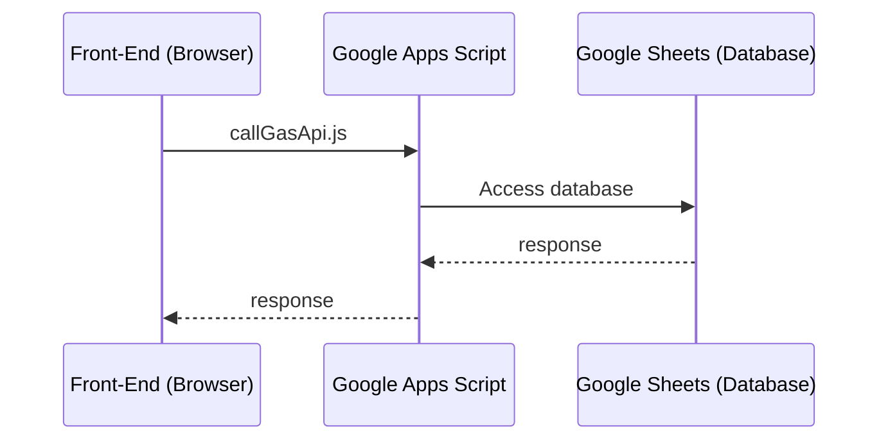

# App structure

It uses Google App Script (GAS) that is along with Spreadsheet to build Database server. It also uses the same GAS for hosting front page.



## Accessing server from front page

It strictly defines how to call server functions from client side. `src/services/apiClient.js` provides a library to call server side functions.

Here is an example use:

```javascript
import apiClient from "./apiClient";

callGasApi("getUserData", ["user123"])
	.then((data) => console.log("GAS Response:", data))
	.catch((error) => console.error("Error:", error));
```
